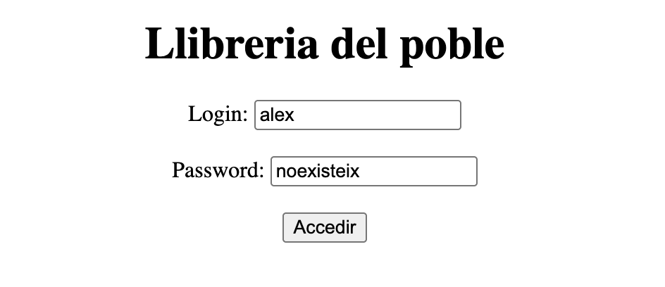
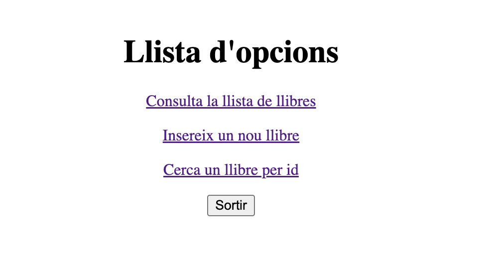
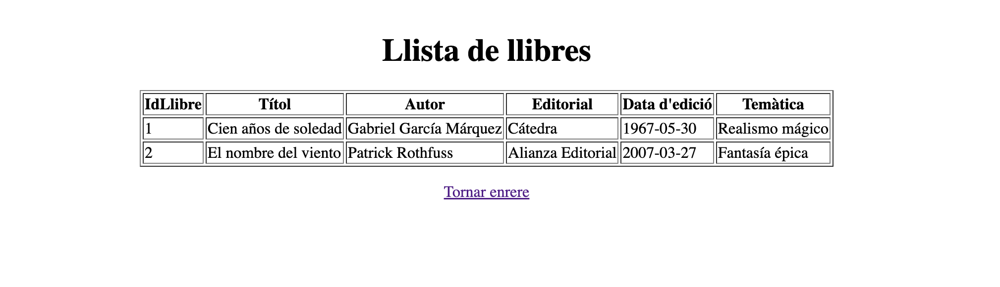
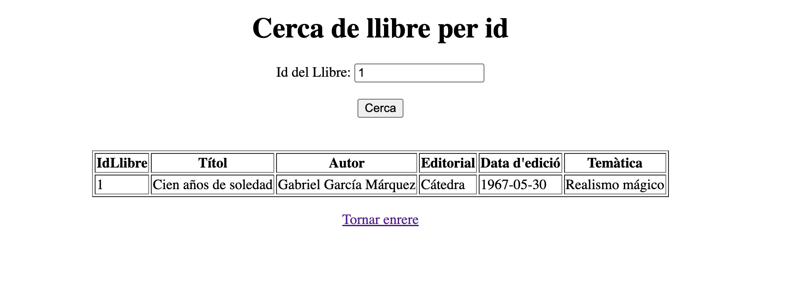
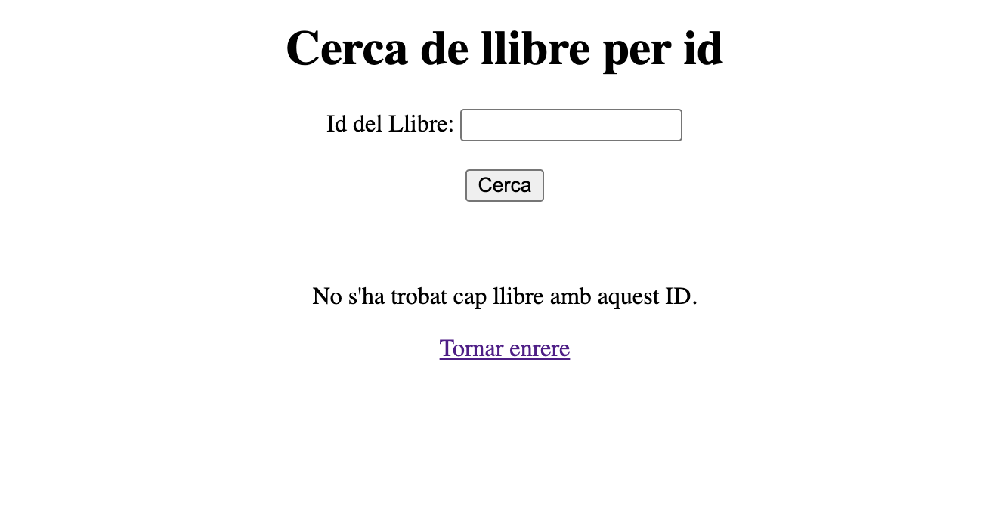
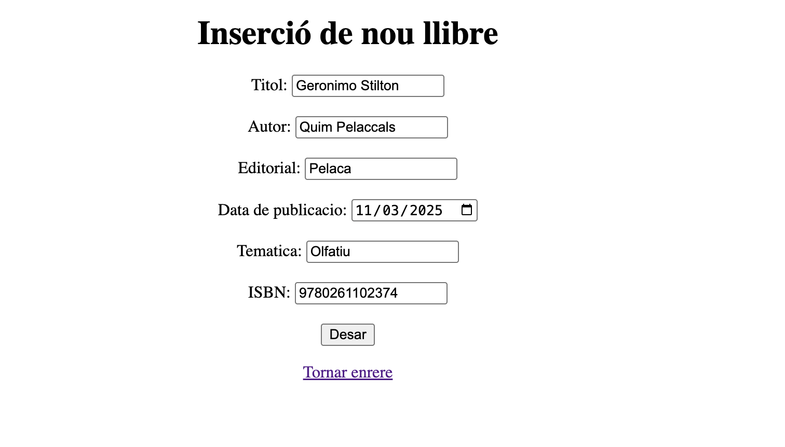
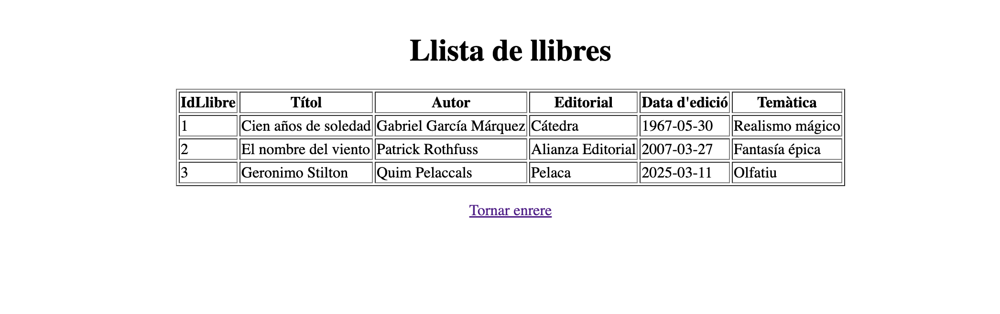

# UF4 Activitat 02

Aquesta activitat té com a objectiu canviar la manera en la que accedim a les dades. Utilitzant una base de dades (MariaDB) per poder persistir els registres dels llibres.

## Usuari creat

```sql
-- Crear l'usuari
create user 'bibliotecari'@'localhost' identified by 'llibre';

-- Assignar tots els permisos sobre la base de dades
GRANT ALL PRIVILEGES ON llibresapp.* TO 'bibliotecari'@'localhost';

-- Aplicar els canvis
FLUSH PRIVILEGES;

-- Verificar els permisos
SHOW GRANTS FOR 'bibliotecari'@'localhost';
```

## Log in

Si l'usuari per accedir no existeix, reenvia de nou al formulari per iniciar sessió:



## Index

Si s'accedeix correctament, es redirigeix al index:



## Llistat



## Cerca per ID

Si el ID existeix:



Si el ID no existeix:



## Inserir un llibre





## preguntes de reflexió

1. Per què al servei estem utilitzant mètodes que no hem declarat explícitament al repositori? Com és possible?
   És possible gràcies a que el repo utilitzat Spring Data JPA està heretant de CrudReposotory. Això permet fer ús d'operacions comuns com save(), findById(), findAll(), deleteById()... sense que calgui implementar-los manualment.

2. El repositori pot elegir fer l’extends de les interfícies PagingAndSortingRepository o de JpaRepository. En què es diferencien aquestes dues amb la interfície CrudRepository?
    - CrudRepository:
        - Proporciona mètodes bàsics per realitzar operacions CRUD (Create, Read, Update, Delete).
        - Exemples de mètodes: save(), findById(), deleteById(), findAll().
        - És la interfície més senzilla i genèrica.
    - PagingAndSortingRepository:
        - Extén CrudRepository i afegeix suport per a paginació i ordenació.
        - Mètodes addicionals: findAll(Pageable pageable) i findAll(Sort sort).
        - Útil quan es vol treballar amb grans volums de dades i mostrar-les en pàgines.
    - JpaRepository:
        Extén PagingAndSortingRepository i afegeix funcionalitats específiques de JPA, com ara:
        - flush(): Sincronitza els canvis amb la base de dades.
        - saveAndFlush(): Desa i sincronitza immediatament.
        - deleteInBatch(): Elimina múltiples entitats en una sola transacció.
        També inclou mètodes per treballar amb consultes JPQL o queries natives.

3. Què significa `Optional<Classe>` i per a què serveix?
   Representa un contenidor per a un valor que pot existir o no (però no retorna null). Es fa servir per evitar errors comuns associats a valors null.
   - Evita excepcions NullPointerException.
  
4. Per què el controlador utilitza el servei i no la seva implementació?
   El controlador utilitza el servei (interfície) en lloc de la seva implementació concreta per seguir el principi de inversió de dependències (un dels principis SOLID). Aquest principi estableix que els mòduls d'alt nivell (com el controlador) no haurien de dependre de mòduls de baix nivell (com la implementació del servei), sinó d'abstraccions (interfaces).

   - Si volem canviar la implementació del servei, només cal modificar la configuració (o el bean) sense tocar el controlador.
   - El controlador es concentra en gestionar les sol·licituds HTTP, mentre que el servei encapsula la lògica de negoci. Això millora la modularitat i facilita el manteniment.
